# CRUD - Productos Gaming

## Sobre mí

Soy Augusto Rodríguez, tengo 20 años, soy estudiante de la Tecnicatura Universitaria en Programación en UTN Avellaneda desde 2024. Actualmente trabajo como técnico de aire acondicionado pero estoy en búsqueda de mi primera experiencia laboral como programador o desarrollador.

## Resumen

**CRUD - Productos Gaming** es un sistema de gestión de stock para una tienda gaming, que permite administrar tres tipos de productos: **consolas**, **videojuegos** y **accesorios**. Todos comparten una jerarquía de clases común (`Producto` como clase abstracta base), pero cada uno con sus propios atributos y comportamientos particulares.

### Funcionalidades principales

- **CRUD completo**: agregar, eliminar, modificar y listar productos.
- **Iterador personalizado**: recorrido de la colección de productos con una implementación propia de `Iterator`.
- **Ordenamiento**: por orden natural (nombre) y por criterios adicionales (precio ascendente/descendente, stock, código).
- **Filtrado**: por categoría, utilizando wildcards (`? extends`, `? super`).
- **Modificaciones masivas**: aplicación de descuentos a productos seleccionados mediante interfaces funcionales (`Consumer`, `Function`, `Predicate`).
- **Persistencia de datos** en tres formatos distintos:
  - Serialización (`.dat`)
  - CSV
  - JSON (usando Gson)
- **Exportación de reportes** a archivo `.txt`, con encabezado descriptivo y formato legible.
- **Manejo de excepciones propias**: `StockInsuficienteException` y `ProductoNoEncontradoException`.
- **Interfaz gráfica** desarrollada con JavaFX, que permite realizar todas las operaciones anteriores desde una ventana interactiva.

### Cómo se usa

1. Al abrir la aplicación, se muestra una tabla con los productos cargados (algunos datos de ejemplo al iniciar).
2. Desde la parte superior se puede **ordenar** la tabla por distintos criterios y **filtrar** por categoría.
3. Desde el formulario inferior se puede **agregar** un producto nuevo (eligiendo el tipo: Consola, Videojuego o Accesorio), **actualizar** uno existente (seleccionándolo primero en la tabla) o **eliminarlo**.
4. Seleccionando una o varias filas, se puede aplicar un **10% de descuento** a los productos que admiten descuento (consolas y videojuegos).
5. Desde el selector de formato se puede **guardar y cargar** el inventario completo en `.dat`, `.csv` o `.json`.
6. El botón de exportar genera un **reporte en `.txt`** con el listado actualmente visible en la tabla.

### Capturas de pantalla

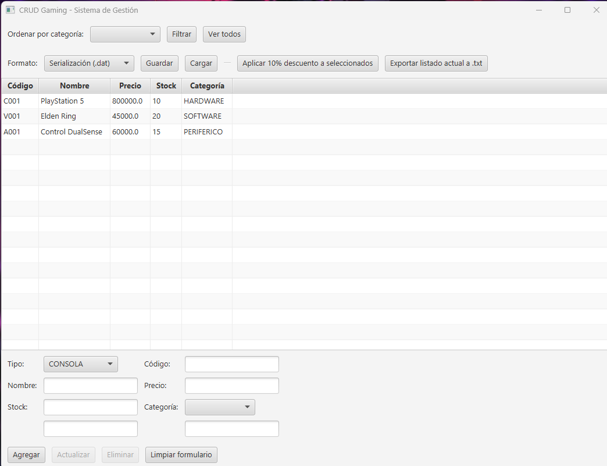
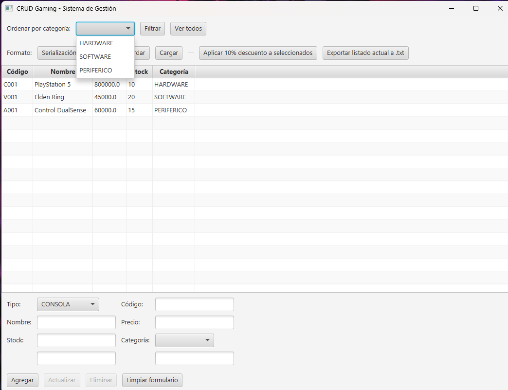
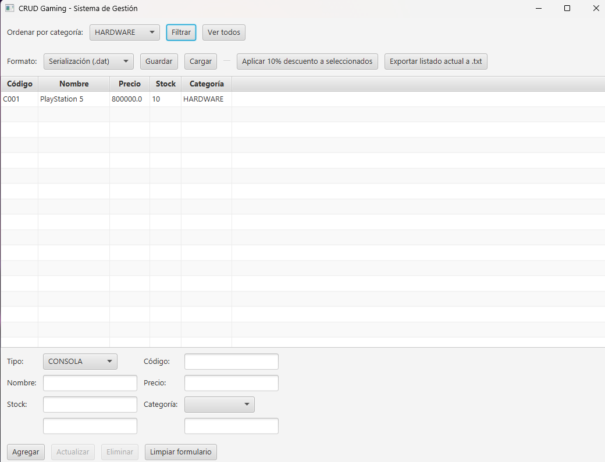
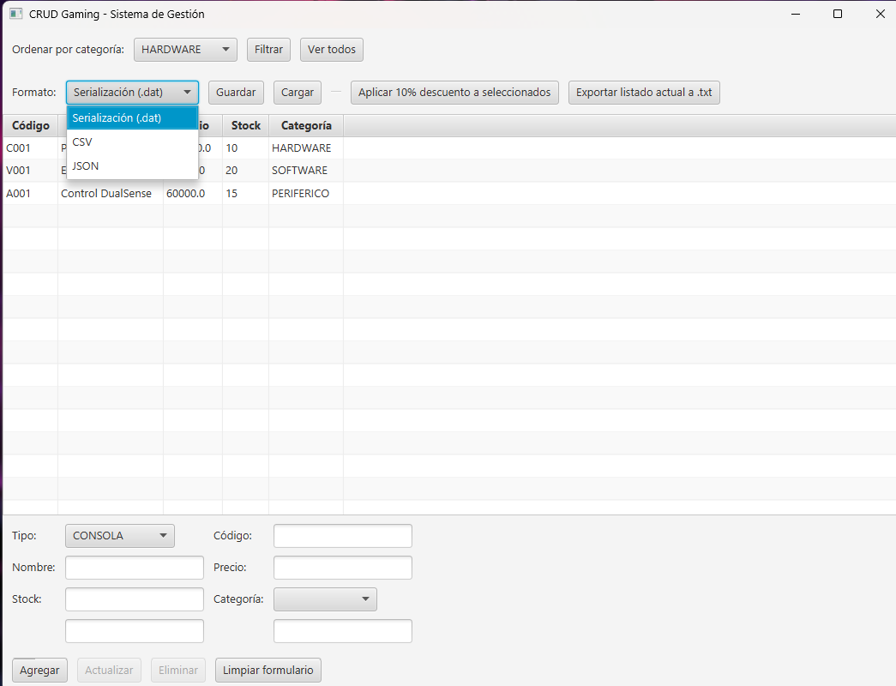
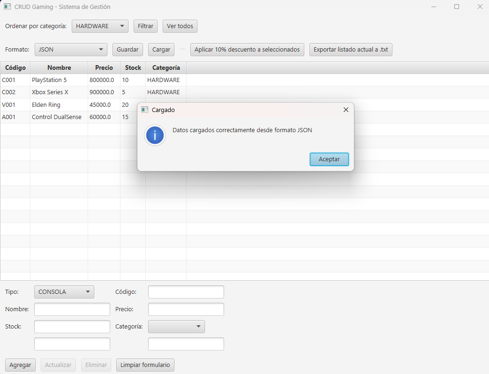
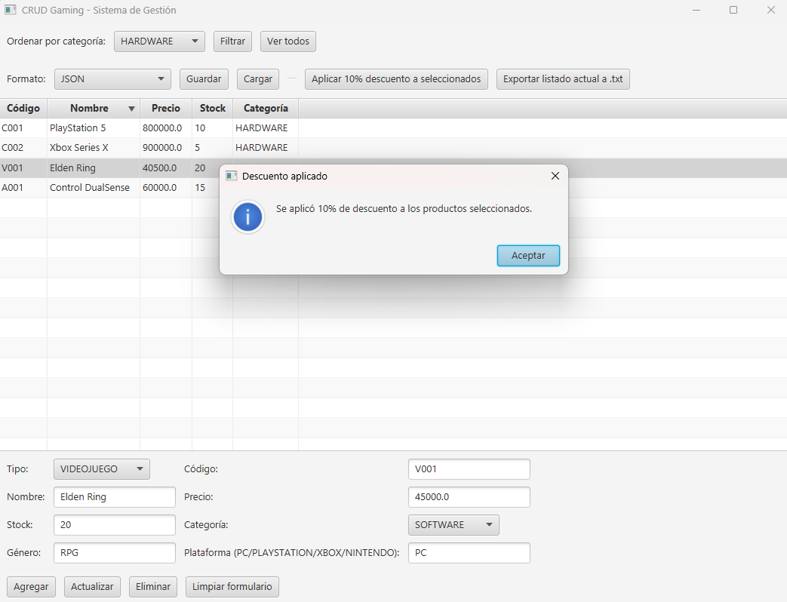
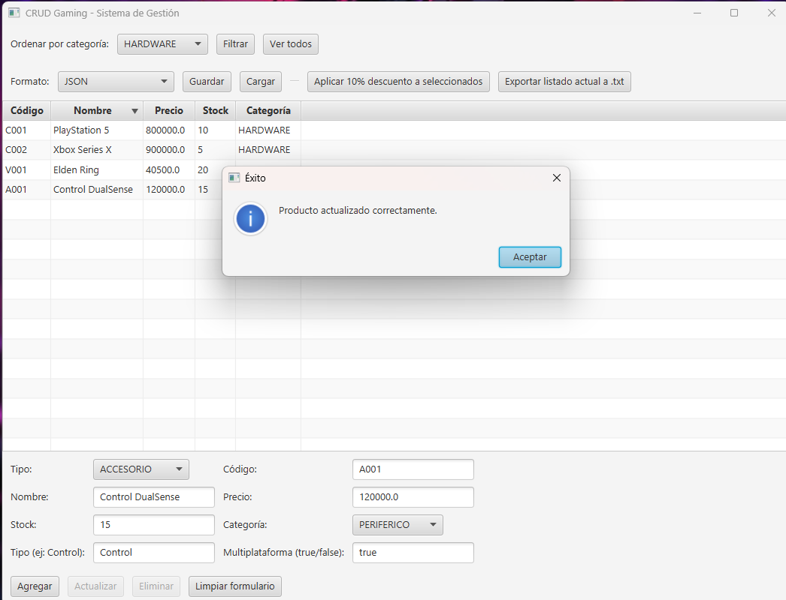
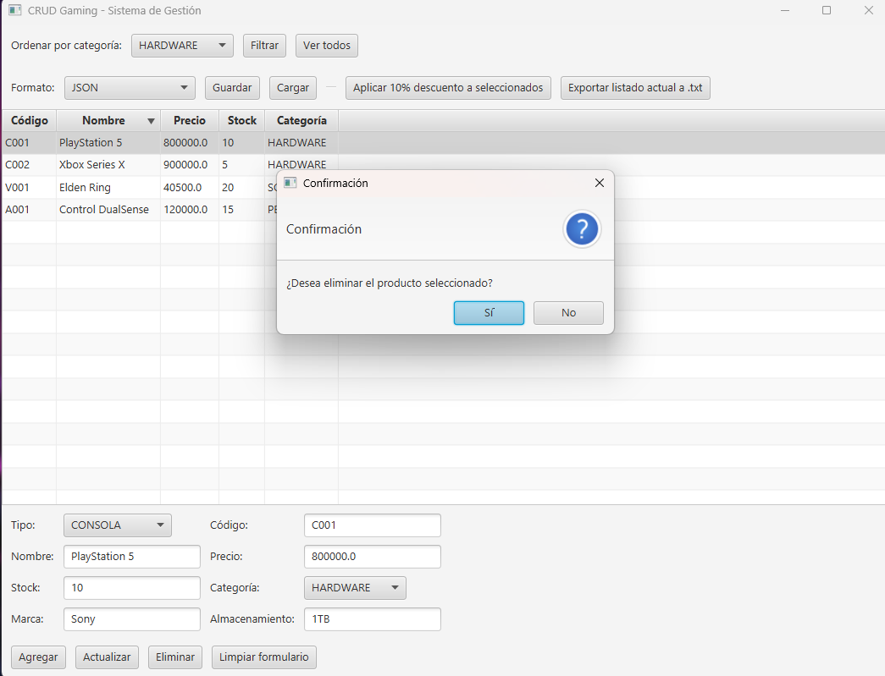
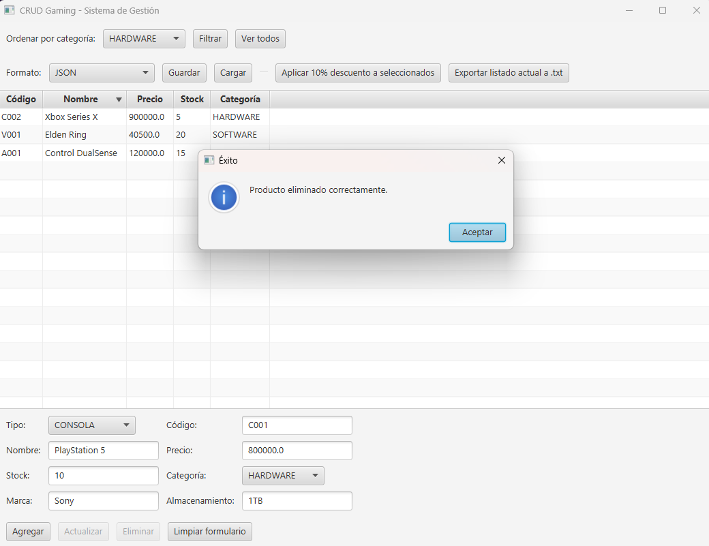
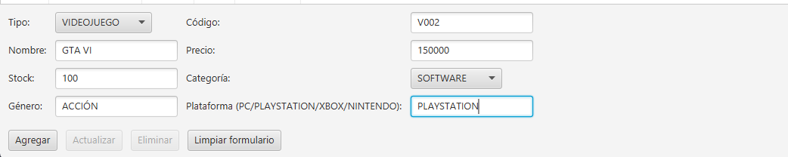
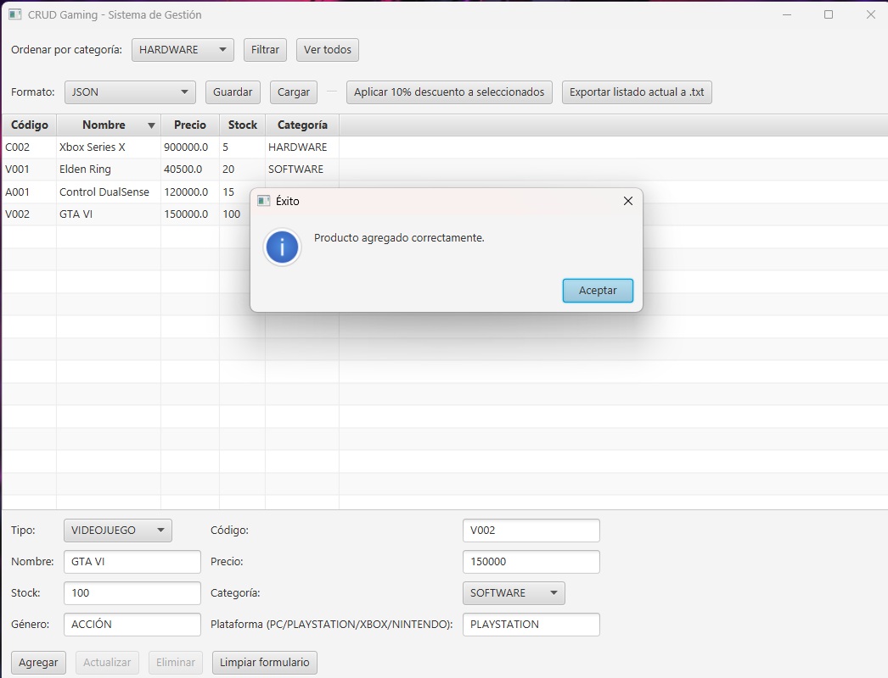
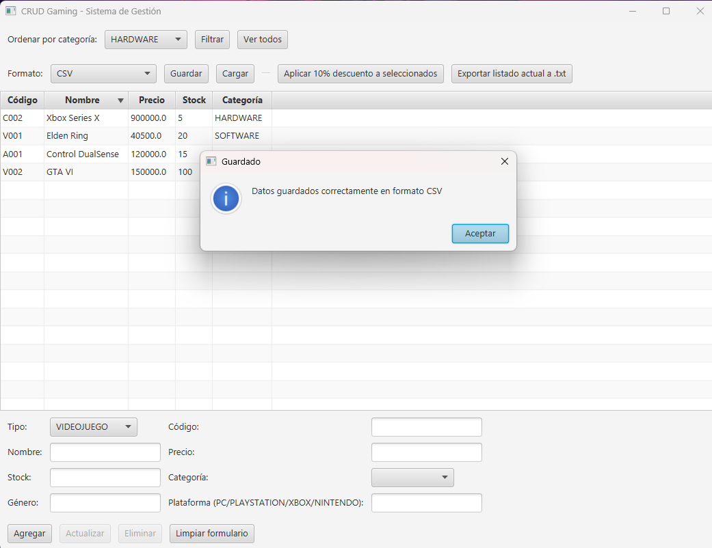
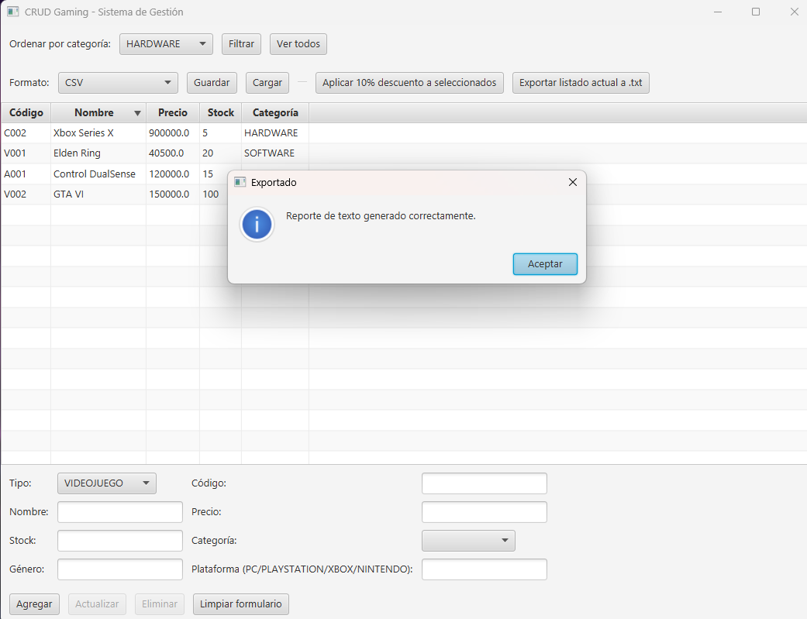
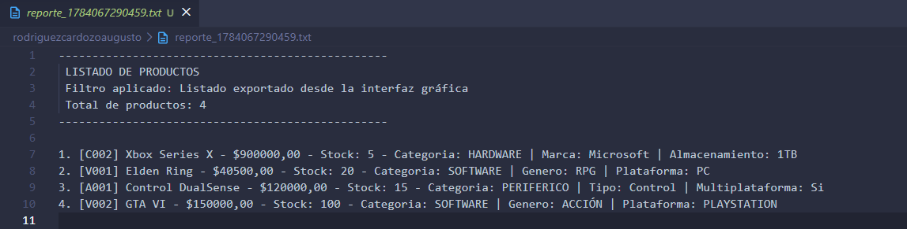

## Diagrama de clases UML

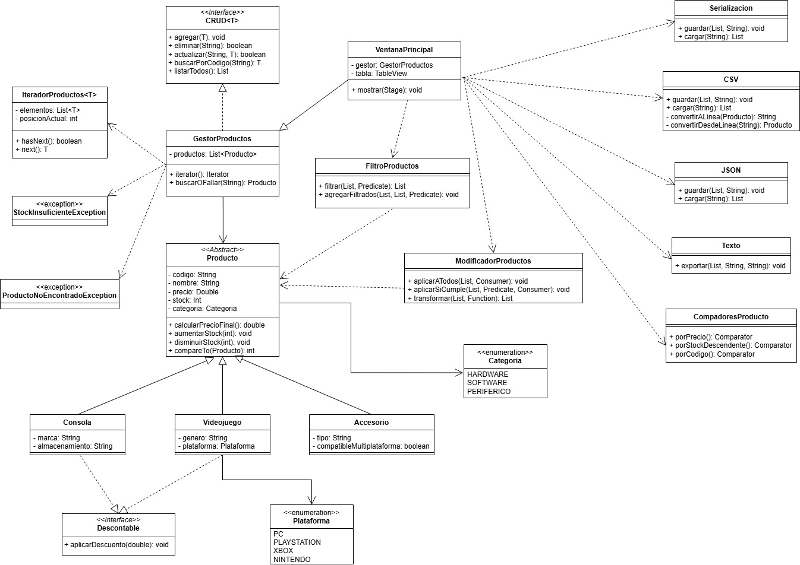

## Archivos generados

En la carpeta principal del proyecto se incluyen ejemplos reales de los archivos que genera el sistema, para cada funcionalidad de persistencia:

- `productos.dat` — ejemplo de serialización.
- `productos.csv` — ejemplo en formato CSV.
- `productos.json` — ejemplo en formato JSON.
- `reporte_1784067290459.txt` — ejemplo de reporte exportado a texto plano, con encabezado descriptivo.
